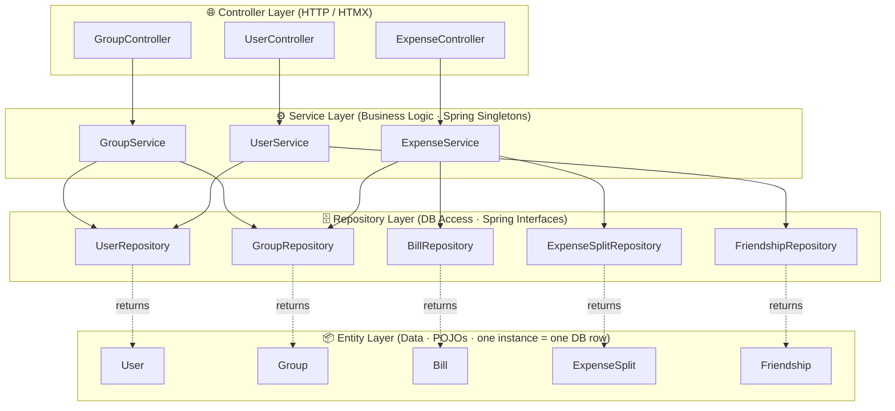
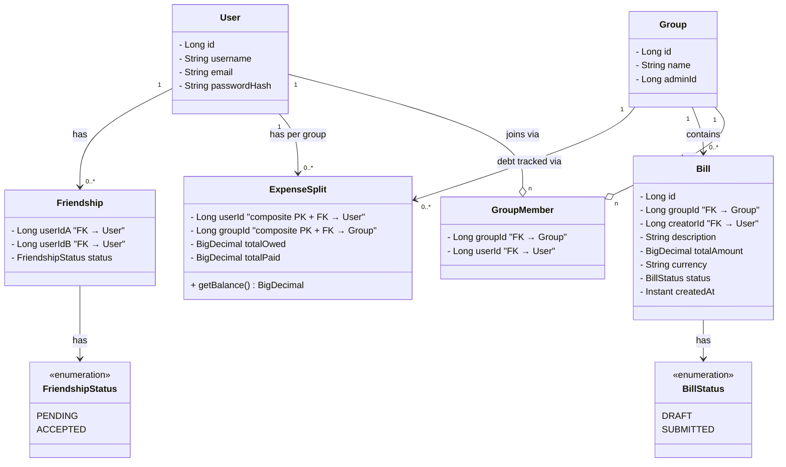
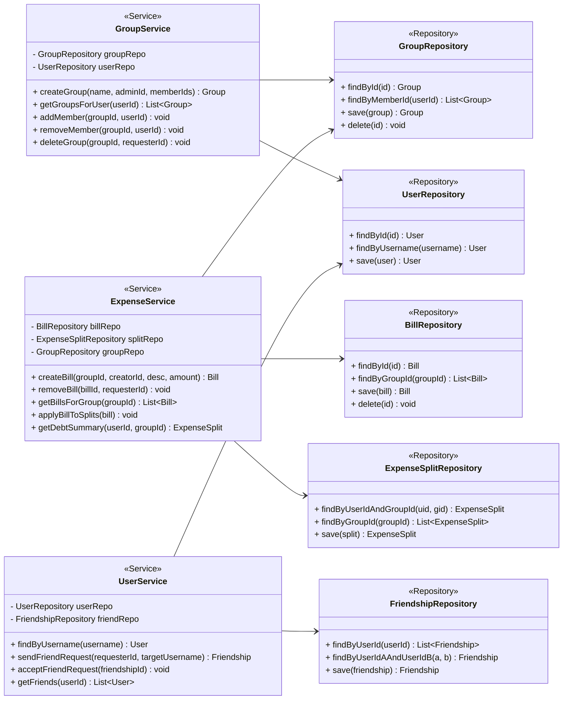

# Teilr — Class Diagram

## Layer 1: Architecture Overview

```mermaid
flowchart TB
    subgraph CONTROLLER ["🌐 Controller Layer  (HTTP / HTMX)"]
        GC["GroupController"]
        EC["ExpenseController"]
        UC["UserController"]
    end

    subgraph SERVICE ["⚙️ Service Layer  (Business Logic · Spring Singletons)"]
        GS["GroupService"]
        ES["ExpenseService"]
        US["UserService"]
    end

    subgraph REPO ["🗄️ Repository Layer  (DB Access · Spring Interfaces)"]
        GR["GroupRepository"]
        BR["BillRepository"]
        ER["ExpenseSplitRepository"]
        UR["UserRepository"]
        FR["FriendshipRepository"]
    end

    subgraph ENTITY ["📦 Entity Layer  (Data · POJOs · one instance = one DB row)"]
        U["User"]
        G["Group"]
        B["Bill"]
        EX["ExpenseSplit"]
        F["Friendship"]
    end

    GC --> GS
    EC --> ES
    UC --> US

    GS --> GR
    GS --> UR
    ES --> BR
    ES --> ER
    ES --> GR
    US --> UR
    US --> FR

    GR -.->|returns| G
    BR -.->|returns| B
    ER -.->|returns| EX
    UR -.->|returns| U
    FR -.->|returns| F
```

---

## Layer 2: Entity Relationships

```mermaid
classDiagram
    direction TB

    class User {
        - Long id
        - String username
        - String email
        - String passwordHash
    }

    class Group {
        - Long id
        - String name
        - Long adminId
    }

    class GroupMember {
        - Long groupId   "FK → Group"
        - Long userId    "FK → User"
    }

    class Bill {
        - Long id
        - Long groupId       "FK → Group"
        - Long creatorId     "FK → User"
        - String description
        - BigDecimal totalAmount
        - String currency
        - BillStatus status
        - Instant createdAt
    }

    class BillStatus {
        <<enumeration>>
        DRAFT
        SUBMITTED
    }

    class ExpenseSplit {
        - Long userId    "composite PK + FK → User"
        - Long groupId   "composite PK + FK → Group"
        - BigDecimal totalOwed
        - BigDecimal totalPaid
        + getBalance() BigDecimal
    }

    class Friendship {
        - Long userIdA   "FK → User"
        - Long userIdB   "FK → User"
        - FriendshipStatus status
    }

    class FriendshipStatus {
        <<enumeration>>
        PENDING
        ACCEPTED
    }

    User "1" --o "n" GroupMember : joins via
    Group "1" --o "n" GroupMember : has
    Group "1" --> "0..*" Bill : contains
    Group "1" --> "0..*" ExpenseSplit : debt tracked via
    User "1" --> "0..*" ExpenseSplit : has per group
    User "1" --> "0..*" Friendship : has
    Bill --> BillStatus : has
    Friendship --> FriendshipStatus : has
```

---

## Layer 3: Service & Repository Detail

```mermaid
classDiagram
    direction LR

    class GroupService {
        <<Service>>
        - GroupRepository groupRepo
        - UserRepository userRepo
        + createGroup(name, adminId, memberIds) Group
        + getGroupsForUser(userId) List~Group~
        + addMember(groupId, userId) void
        + removeMember(groupId, userId) void
        + deleteGroup(groupId, requesterId) void
    }

    class ExpenseService {
        <<Service>>
        - BillRepository billRepo
        - ExpenseSplitRepository splitRepo
        - GroupRepository groupRepo
        + createBill(groupId, creatorId, desc, amount) Bill
        + removeBill(billId, requesterId) void
        + getBillsForGroup(groupId) List~Bill~
        + applyBillToSplits(bill) void
        + getDebtSummary(userId, groupId) ExpenseSplit
    }

    class UserService {
        <<Service>>
        - UserRepository userRepo
        - FriendshipRepository friendRepo
        + findByUsername(username) User
        + sendFriendRequest(requesterId, targetUsername) Friendship
        + acceptFriendRequest(friendshipId) void
        + getFriends(userId) List~User~
    }

    class GroupRepository {
        <<Repository>>
        + findById(id) Group
        + findByMemberId(userId) List~Group~
        + save(group) Group
        + delete(id) void
    }

    class BillRepository {
        <<Repository>>
        + findById(id) Bill
        + findByGroupId(groupId) List~Bill~
        + save(bill) Bill
        + delete(id) void
    }

    class ExpenseSplitRepository {
        <<Repository>>
        + findByUserIdAndGroupId(uid, gid) ExpenseSplit
        + findByGroupId(groupId) List~ExpenseSplit~
        + save(split) ExpenseSplit
    }

    class UserRepository {
        <<Repository>>
        + findById(id) User
        + findByUsername(username) User
        + save(user) User
    }

    class FriendshipRepository {
        <<Repository>>
        + findByUserId(userId) List~Friendship~
        + findByUserIdAAndUserIdB(a, b) Friendship
        + save(friendship) Friendship
    }

    GroupService --> GroupRepository
    GroupService --> UserRepository
    ExpenseService --> BillRepository
    ExpenseService --> ExpenseSplitRepository
    ExpenseService --> GroupRepository
    UserService --> UserRepository
    UserService --> FriendshipRepository
```