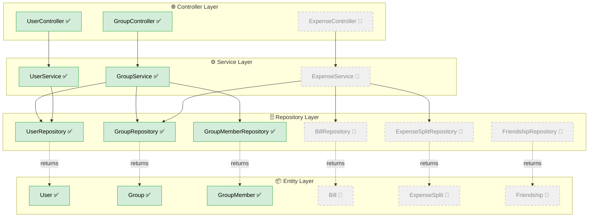
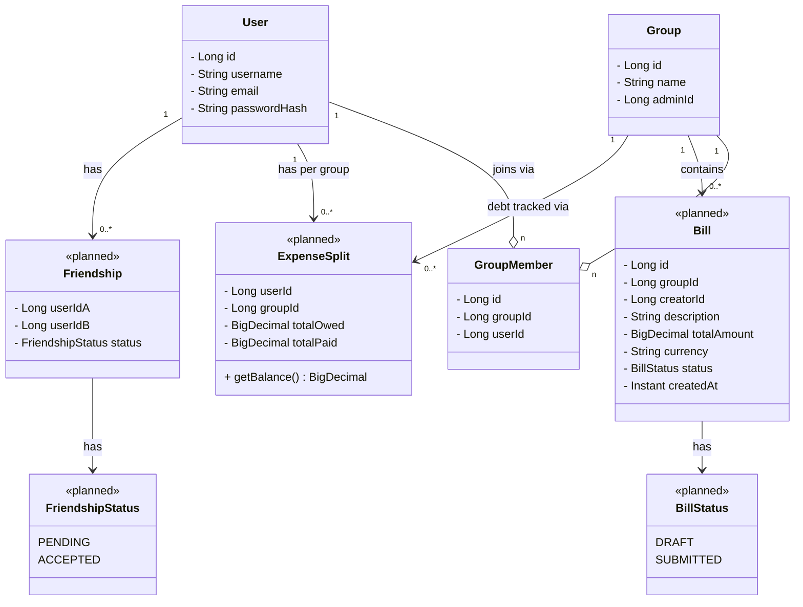
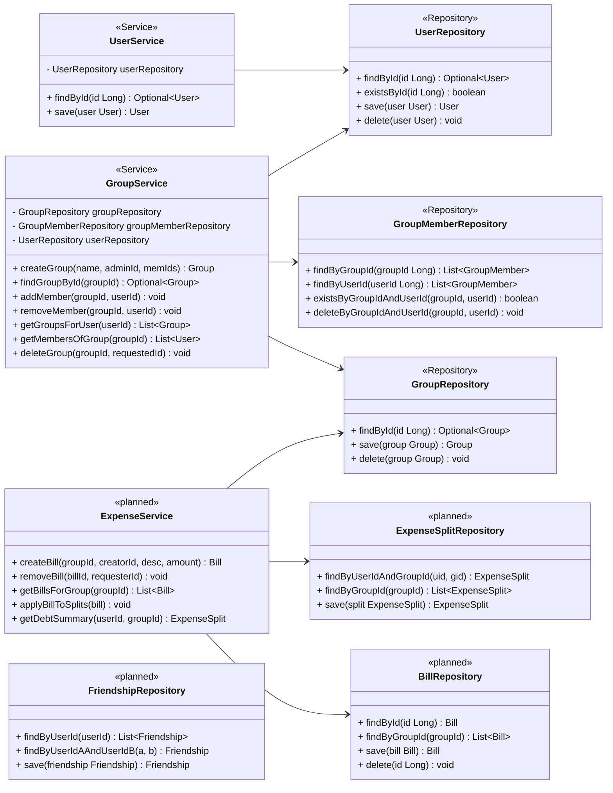
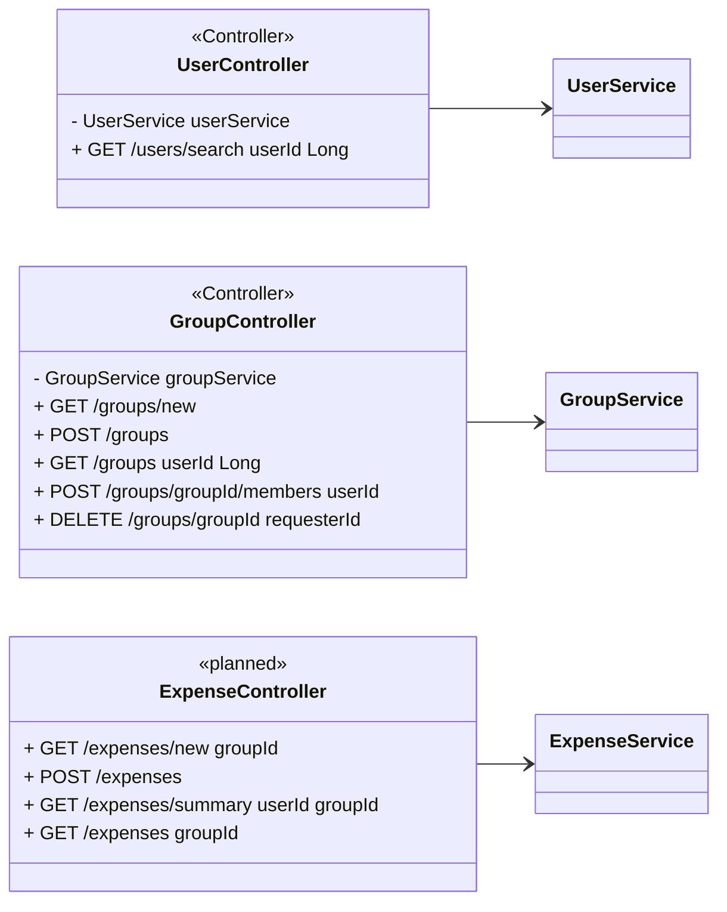

# Teilr — Class Diagram
> ✅ = currently coded · 🔲 = planned (not yet implemented)

---

## Layer 1: Architecture Overview

---

## Layer 2: Entity Relationships

---

## Layer 3: Service & Repository Detail

---

## Layer 4: Controller Endpoints

