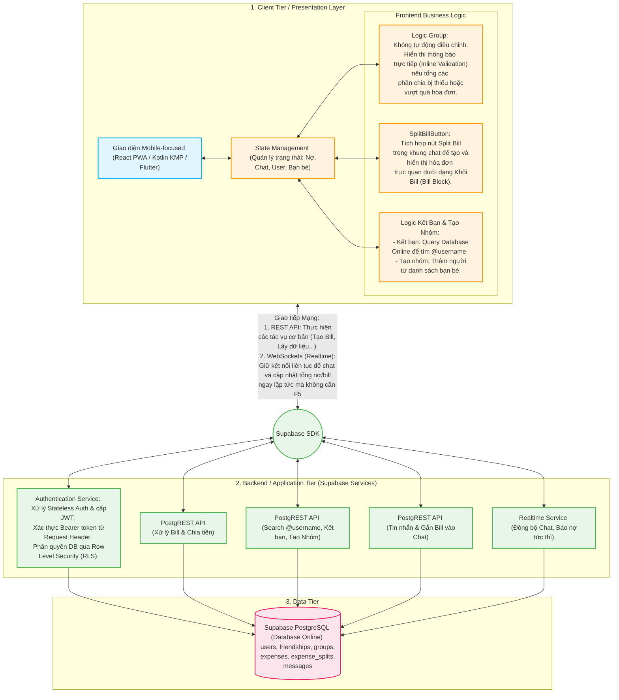

# Kiến trúc Hệ thống cho Ứng dụng Quản lý Chia Tiền (Mobile-focused Web App)

## 1. Công nghệ đề xuất cho Frontend (Các lựa chọn)

### Lựa chọn A: [PWA Web-App](https://developer.mozilla.org/en-US/docs/Web/Progressive_web_apps) ([React](https://react.dev/) + [Vite](https://vitejs.dev/) / [Next.js](https://nextjs.org/))
*   **Mô tả:** Tập trung xây dựng một trang web thuần túy nhưng có giao diện và tương tác giống hệt App điện thoại.
*   **Ưu điểm:** Nhanh, dễ làm. Chỉ cần code 1 lần là chạy được trên trình duyệt của máy tính lẫn điện thoại. Giao diện CSS hiện đại.
*   **Nhược điểm:** Cảm giác mượt mà không thể bằng 100% Native App.

### Lựa chọn B: [Kotlin Multiplatform (KMP)](https://kotlinlang.org/docs/multiplatform.html) / [Compose Multiplatform](https://www.jetbrains.com/lp/compose-multiplatform/)
*   **Mô tả:** Sử dụng ngôn ngữ **Kotlin** để viết logic, và dùng **Compose** làm giao diện chung cho Android, iOS và Web.
*   **Ưu điểm:** Hiệu năng Native (cực kỳ mượt) khi build ra điện thoại.
*   **Nhược điểm:** Phần xuất ra Web (Compose for Web) hiện vẫn chưa quá trưởng thành. Phù hợp nếu ưu tiên Mobile App trước.

### Lựa chọn C: [Flutter](https://flutter.dev/) (Dart) hoặc [React Native](https://reactnative.dev/)
*   **Mô tả:** Các công cụ làm Cross-platform phổ biến (chạy Web, iOS, Android).

## 2. Giao tiếp Mạng & Công nghệ Backend ([Supabase](https://supabase.com/docs))

Chúng ta sẽ ưu tiên sử dụng **[Supabase](https://supabase.com/docs) (Database Online)** làm Backend-as-a-Service vì phí rẻ/miễn phí và dễ kết nối từ xa.

### A. Giao tiếp Mạng (Network Layer)
*   **[REST API](https://developer.mozilla.org/en-US/docs/Glossary/REST):** Dùng để thực hiện các tác vụ cơ bản, bất đồng bộ (Tạo Bill, Lấy dữ liệu lịch sử, Tìm kiếm User).
*   **[WebSockets](https://developer.mozilla.org/en-US/docs/Web/API/WebSockets_API) (Realtime):** Duy trì kết nối liên tục giúp ứng dụng nhận tin nhắn Chat và cập nhật số nợ/tổng hóa đơn ngay lập tức (instant) mà không cần phải F5/tải lại trang.

### B. Cơ chế Xác thực & Phân quyền (Authentication & Authorization)
*   **Stateless Auth & [JWT](https://jwt.io/introduction):** Khi đăng nhập, Backend cấp một [JSON Web Token (JWT)](https://jwt.io/introduction).
*   **[Bearer Token](https://swagger.io/docs/specification/authentication/bearer-authentication/):** Frontend sẽ lưu JWT này và đính kèm vào Request Header (`Authorization: Bearer <token>`) trong mọi API call tiếp theo.
*   **[Row Level Security (RLS)](https://supabase.com/docs/guides/auth/row-level-security):** Database giải mã JWT payload để định danh User (sub). Dựa vào đó, RLS dưới database sẽ tự động chặn/cho phép quyền đọc/ghi dữ liệu (vd: Không ai đọc được tin nhắn hoặc sửa Bill của bạn ngoại trừ bạn và người trong nhóm).

---

## 3. Thiết kế Cơ sở dữ liệu (Database Schema)

Cơ sở dữ liệu PostgreSQL (Online). Dưới đây là các bảng chính:

*   **`users`**: `id`, `username`, `email`
*   **`friendships`**: `user_id_1`, `user_id_2`, `status`
*   **`groups`**: `id`, `name`
*   **`group_members`**: `group_id`, `user_id`
*   **`expenses`**: `id`, `creator_id`, `group_id` (NULL nếu cá nhân), `total_amount`, `currency`, `created_at`
*   **`messages`**: `id`, `sender_id`, `receiver_id`, `group_id`, `type` (text/bill), `content`, `expense_id` (nếu type là bill)

### Bảng `expense_splits` (Chi tiết chia tiền)
Bảng quan trọng nhất để tính ai nợ ai:
*   `expense_id`: ID của bill
*   `user_id`: ID của người tham gia
*   `amount_owed`: Decimal(10, 2) (Số tiền người này **phải chịu**).
*   `amount_paid`: Decimal(10, 2) (Số tiền người này **đã trả trước**).
*   *Logic Công Nợ:* `amount_paid - amount_owed` (Dương: Được nợ, Âm: Nợ người khác).

---

## 4. Luồng hoạt động & Business Logic (Workflows)

### A. Logic Chia Tiền Nhóm (Group)
*   **Mặc định:** Chia đều cho tổng số thành viên nhóm.
*   **Inline Validation (Cảnh báo tại chỗ):** Không tự động cân bằng. Nếu bạn nhập sai số tiền, hệ thống hiện cảnh báo trực tiếp (Inline Validation) bên dưới: *"Vượt quá 2.00 EUR"* hoặc *"Còn thiếu X.XX EUR"*. Nút gửi chỉ sáng khi tổng khớp.
--> Tổng hợp các bill để tính sau cùng

### B. Logic Chat & Khối Bill
*   Giao tiếp cá nhân/nhóm hoạt động như một ứng dụng nhắn tin.
*   Tích hợp nút **"Split Bill"** trực tiếp trong khung chat. Khi bấm vào, thay vì gửi text, ứng dụng tạo ra một **Khối Bill (Bill Block)** để mọi người bấm vào xem và xác nhận trực quan ngay trong đoạn hội thoại.

### C. Logic Kết Bạn & Tạo Nhóm
*   **Kết bạn:** Người dùng gõ `@username` vào thanh tìm kiếm. Frontend sẽ gửi lệnh qua REST API lên Database Online để query chính xác User đó.
*   **Tạo Nhóm:** Giao diện hiển thị danh sách bạn bè đã kết bạn, người dùng chỉ cần tick chọn để gom vào Group mới.
