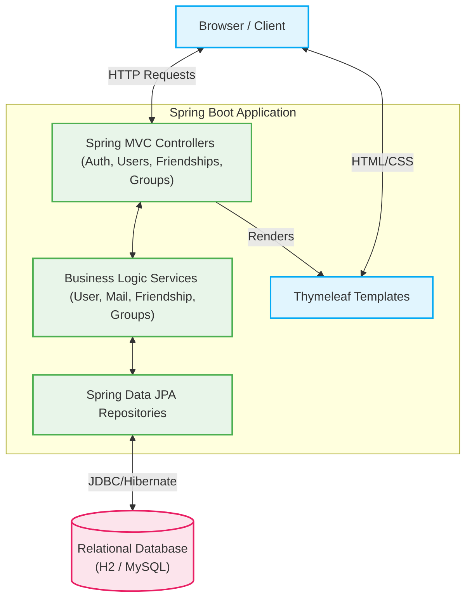

# Teilr - Social Expense Splitting Application

Teilr is a modern web application designed to eliminate the awkwardness and frustration of splitting expenses among friends, roommates, and travel groups.

<p align="center">
  
</p>

## Why Teilr? (Market Necessity)

Sharing finances is a frequent source of tension. Based on recent consumer surveys and research from [Starling Bank](https://www.starlingbank.com/news/more-than-half-of-holiday-arguments-stem-from-disagreements-about-money/), [Money Wellness](https://www.moneywellness.com/blog/money-disagreements-top-causes-of-arguments-between-friends-on-holiday), [Nationalwide](https://www.nationwide.co.uk/media/news/house-share-from-hell-brits-reveal-lack-of-sharing-leads-to-housemate-squabbles), [Barclays](https://home.barclays/news/press-releases/2020/11/are-you-a--flatmare---nightmare-flatmates-cost-brits-p434-millio/):
- **Shared Living Conflicts:** 2,001 people who had lived in shared accommodation found that 83% had disagreements with housemates, with cleaning the top complaint, followed by bills and money.
- **Travel Fallouts:** 51% of UK adults have fallen out with a friend on holiday, and 54% of those arguments were triggered by money disagreements.

**The Solution:** By providing real-time transparency, automated debt calculation, and an objective third-party system, Teilr removes the "mental load" of tracking who paid for what and actively helps preserve relationships.

## Technology Stack

Teilr is built on a robust, production-ready Java ecosystem:
- **Backend Framework:** Java 21 & Spring Boot 3.5.x
- **Security:** Spring Security (Form-based authentication, BCrypt password hashing, email verification)
- **Database:** H2 (In-Memory for Dev) / MySQL (Persistent via profile)
- **ORM / Persistence:** Spring Data JPA & Hibernate
- **Frontend / Views:** Thymeleaf & Vanilla CSS/JS
- **Build Tool:** Maven Wrapper (`mvnw`)

## Architecture



## Features

- **User Authentication:** Secure registration and login flows.
- **Social System:** Send and accept friendship requests (`Friendships`).
- **Group Management:** Create groups and manage members (`UserGroups`, `GroupMembers`).
- **Expense Tracking:** Create bills (`Bills`, `ExpenseSplits`) within groups, defining exactly who owes what (equally or specific amounts).
- **Settlements:** Keep track of who has paid whom and automatically calculate remaining balances (`Settlements`).

## How to Run Locally

### Prerequisites
- JDK 21 or higher installed on your machine.
- (Optional) MySQL Server if you wish to persist data.

### Quick Start (Development Mode)
The application uses an in-memory H2 database by default. You do not need to install a database to get started.

```bash
# Clone the repository and run via Maven Wrapper
./mvnw spring-boot:run
```
*(On Windows, use `mvnw.cmd spring-boot:run`)*

Once started, the app will be accessible at: **[http://localhost:8080](http://localhost:8080)**.
You can access the database console at `http://localhost:8080/h2-console` (JDBC URL: `jdbc:h2:mem:teilr`, Username: `sa`, Password: `[empty]`).

### Production Mode (MySQL)
To run the application with a persistent MySQL database, configure your credentials in `src/main/resources/application-mysql.properties` and run with the `mysql` profile:

```bash
./mvnw spring-boot:run -Dspring-boot.run.profiles=mysql
```
