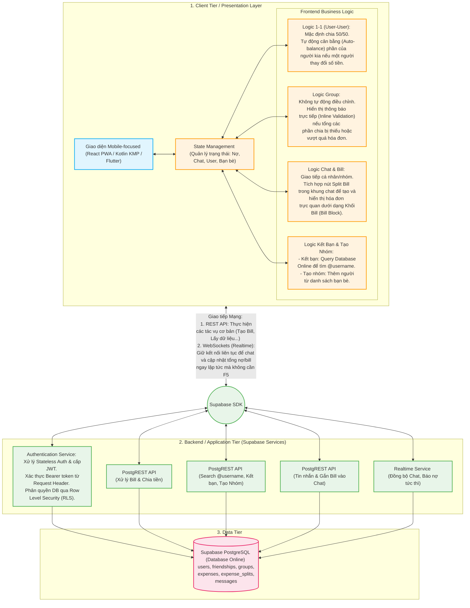

```mermaid
flowchart TD
    %% Định nghĩa màu sắc
    classDef frontend fill:#e1f5fe,stroke:#03a9f4,stroke-width:2px;
    classDef logic fill:#fff3e0,stroke:#ff9800,stroke-width:2px;
    classDef backend fill:#e8f5e9,stroke:#4caf50,stroke-width:2px;
    classDef database fill:#fce4ec,stroke:#e91e63,stroke-width:2px;

    %% Client Layer
    subgraph Client_Tier ["1. Client Tier / Presentation Layer"]
        UI["Giao diện Mobile-focused <br/> (React PWA / Kotlin KMP / Flutter)"]:::frontend
        State["State Management <br/> (Quản lý trạng thái: Nợ, Chat, User, Bạn bè)"]:::logic
        
        UI <--> State
        
        subgraph Business_Logic ["Frontend Business Logic"]
            Logic1["Logic 1-1 (User-User): <br/> Mặc định chia 50/50. <br/> Tự động cân bằng (Auto-balance) phần của <br/> người kia nếu một người thay đổi số tiền."]:::logic
            Logic2["Logic Group: <br/> Không tự động điều chỉnh. Hiển thị thông báo <br/> trực tiếp (Inline Validation) nếu tổng các <br/> phần chia bị thiếu hoặc vượt quá hóa đơn."]:::logic
            ChatLogic["Logic Chat & Bill: <br/> Giao tiếp cá nhân/nhóm. Tích hợp nút Split Bill <br/> trong khung chat để tạo và hiển thị hóa đơn <br/> trực quan dưới dạng Khối Bill (Bill Block)."]:::logic
            SocialLogic["Logic Kết Bạn & Tạo Nhóm: <br/> - Kết bạn: Query Database Online để tìm @username. <br/> - Tạo nhóm: Thêm người từ danh sách bạn bè."]:::logic
        end
        
        State <--> Logic1
        State <--> Logic2
        State <--> ChatLogic
        State <--> SocialLogic
    end

    %% Network Layer
    API_Gateway(("Supabase SDK")):::backend

    Client_Tier <-->|"Giao tiếp Mạng: <br/> 1. REST API: Thực hiện các tác vụ cơ bản (Tạo Bill, Lấy dữ liệu...) <br/> 2. WebSockets (Realtime): Giữ kết nối liên tục để chat <br/> và cập nhật tổng nợ/bill ngay lập tức mà không cần F5"| API_Gateway

    %% Backend Layer
    subgraph Backend_Tier ["2. Backend / Application Tier (Supabase Services)"]
        Auth["Authentication Service: <br/> Xử lý Stateless Auth & cấp JWT. <br/> Xác thực Bearer token từ Request Header. <br/> Phân quyền DB qua Row Level Security (RLS)."]:::backend
        ExpenseSvc["PostgREST API <br/> (Xử lý Bill & Chia tiền)"]:::backend
        UserGroupSvc["PostgREST API <br/> (Search @username, Kết bạn, Tạo Nhóm)"]:::backend
        ChatSvc["PostgREST API <br/> (Tin nhắn & Gắn Bill vào Chat)"]:::backend
        Realtime["Realtime Service <br/> (Đồng bộ Chat, Báo nợ tức thì)"]:::backend
    end

    API_Gateway <--> Auth
    API_Gateway <--> ExpenseSvc
    API_Gateway <--> UserGroupSvc
    API_Gateway <--> ChatSvc
    API_Gateway <--> Realtime

    %% Data Layer
    subgraph Database_Tier ["3. Data Tier"]
        DB[("Supabase PostgreSQL (Database Online) <br/> users, friendships, groups, <br/> expenses, expense_splits, messages")]:::database
    end

    Auth --> DB
    ExpenseSvc --> DB
    UserGroupSvc --> DB
    ChatSvc --> DB
    Realtime --> DB
```